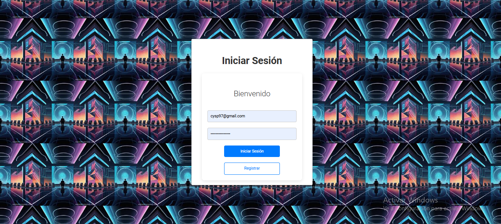
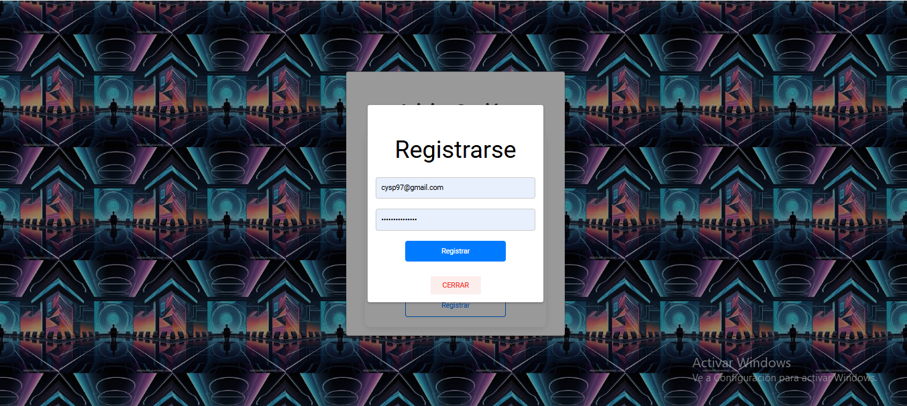
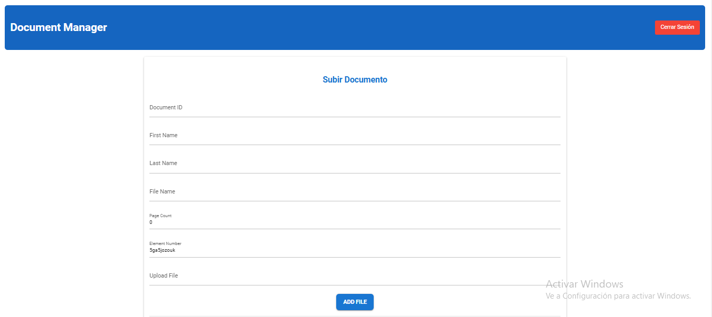
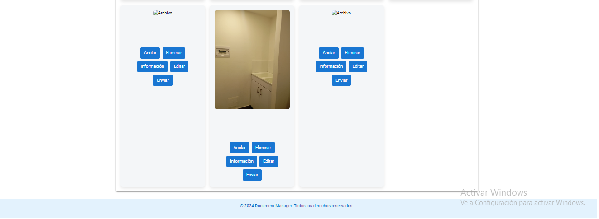
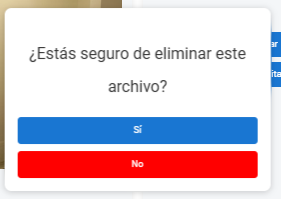
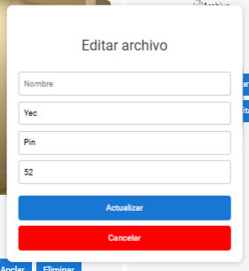
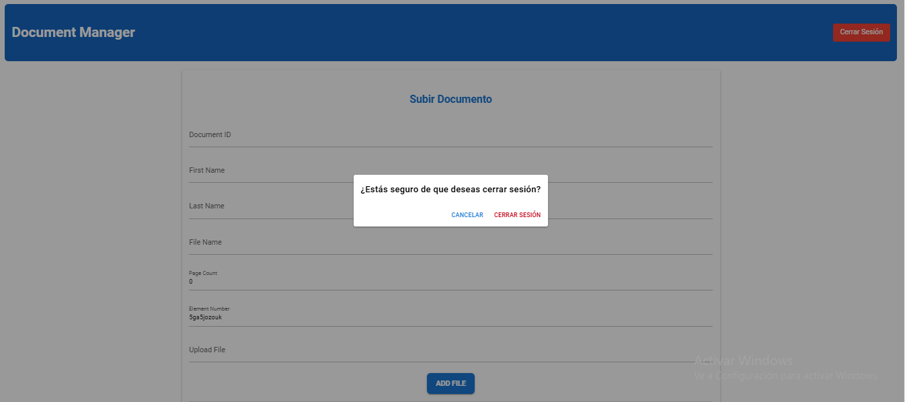

# Virtual Document Drawer App

 

## Descripción

La **Virtual Document Drawer App** es una aplicación web diseñada para gestionar y almacenar documentos de manera eficiente. Los usuarios pueden cargar, visualizar y eliminar documentos fácilmente, todo en un entorno intuitivo y responsivo. Esta aplicación utiliza Firebase como backend para almacenar y manejar los documentos, asegurando un rendimiento óptimo y una experiencia de usuario fluida.

## Características

- **Carga de Documentos:** Permite a los usuarios subir archivos de diferentes formatos.
- **Visualización de Archivos:** Los usuarios pueden ver los documentos cargados en una interfaz clara y organizada.
- **Eliminación de Archivos:** Opción para eliminar documentos no deseados de la lista.
- **Interfaz Responsiva:** Diseñada para funcionar en dispositivos de escritorio, tabletas y móviles.
- **Modales Mejorados:** Los modales de confirmación son visualmente atractivos y fáciles de usar.

## Tecnologías Utilizadas

- **Frontend:** Vue.js
- **Backend:** Firebase (Firestore y Firebase Storage)
- **Estilo:** SCSS para un diseño responsivo y moderno

## Implementación en Firebase Hosting

1. **Instalar Firebase CLI:**
   Si aún no lo has hecho, instala Firebase CLI globalmente:
   ```bash
   npm install -g firebase-tools

2. **Iniciar sesión en Firebase**
   Autentica tu cuenta de Firebase:
   ```bash
   firebase login

3. **Inicializar tu proyecto Firebase**
   Ve al directorio de tu proyecto y ejecuta:
   ```bash
   firebase init

   - Selecciona Hosting.
   - Elige el proyecto que has creado en Firebase.
   - Asegúrate de configurar la carpeta pública como dist o la carpeta donde se construyen los archivos de tu aplicación.
   - Responde "Sí" a la opción de sobrescribir index.html si no tienes configuraciones adicionales.

4. **Construir tu aplicación**
    Si estás utilizando Vue CLI, asegúrate de construir tu aplicación:
   ```bash
   npm run build

5. **Desplegar la aplicación**
   Después de construir tu aplicación, despliega tu proyecto en Firebase Hosting:
   ```bash
   firebase deploy

6. **Acceder a tu aplicación**
   Una vez que el despliegue se complete, podrás acceder a tu aplicación en la URL proporcionada (ejemplo: https://virtual-document-drawer-app.web.app).

## Capturas de Pantalla

# Login


# Registrarse


# Formulario


# Cuadrillas


# Anclar


# Eliminar


# Editar


# Informacion


# Enviar


# Cerrar sesion


## Contribuciones
Si deseas contribuir a este proyecto, siéntete libre de realizar un fork y enviar un pull request. Se aceptan sugerencias y mejoras.

## Licencia
Este proyecto está bajo la Licencia MIT. Para más detalles, consulta el archivo LICENSE.

